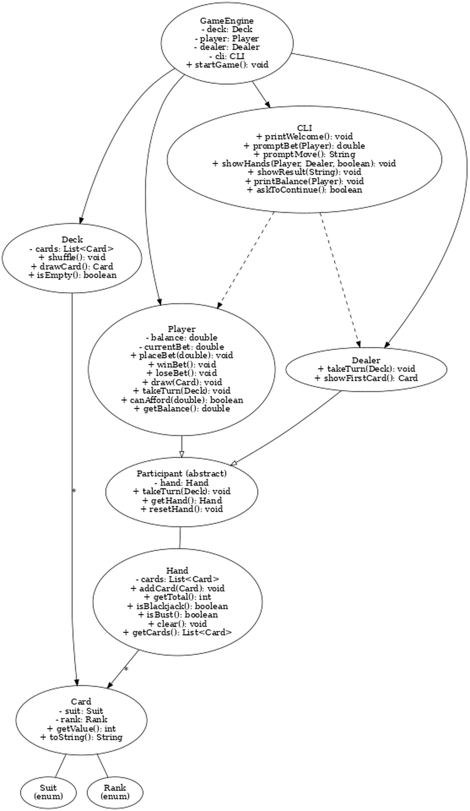

# CS210Final
Software Design Final Project
A simple Blackjack game played in the command line, written in Java. Built as a course project for Software Design & Architecture to demonstrate OOP, SOLID principles, and clean design.

---

## What It Does

- Lets a player play Blackjack against an automated dealer
- Supports betting with a balance system
- Handles Hit/Stand choices
- Detects Blackjack, busts, and ties
- Keeps playing until you quit or run out of money

---

## How It’s Built

### Key Classes
- `Card`, `Deck`, `Hand`: Core card logic
- `Player`, `Dealer`: Participants
- `GameEngine`: Runs the game loop
- `CLI`: Handles user input/output

### Concepts Used
- OOP: Inheritance, abstraction, encapsulation
- SOLID: Clean separation of logic and responsibilities
- Design Patterns:
  - Factory (deck/cards)
  - Strategy (dealer behavior logic)

---

